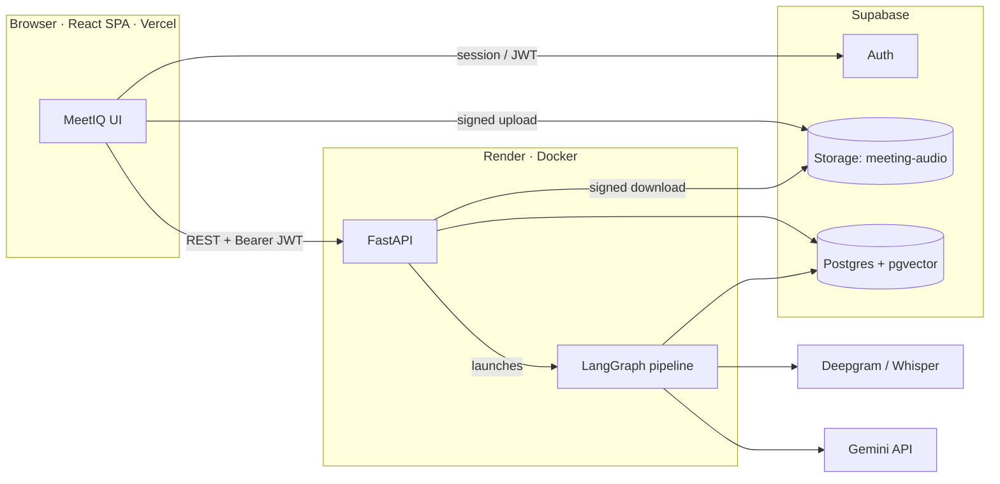
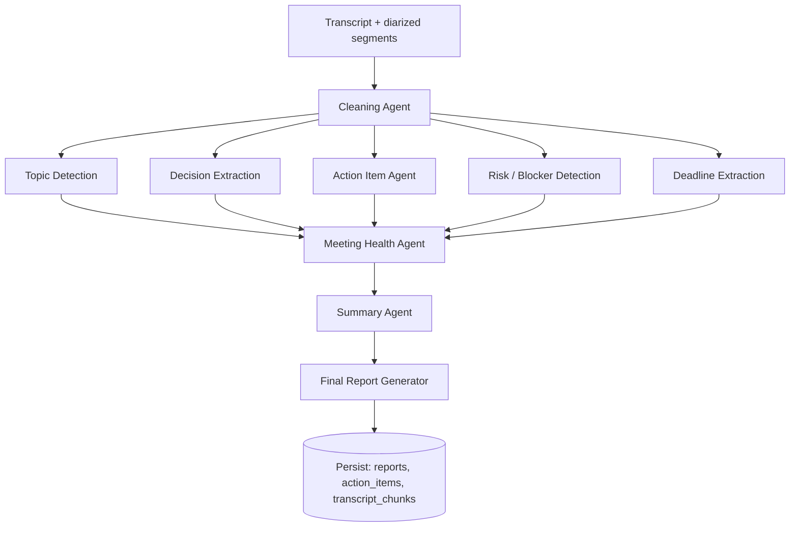
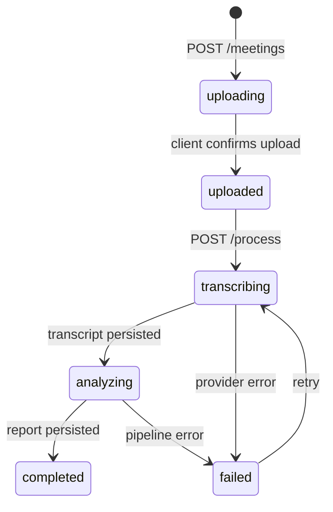

# MeetIQ — System Architecture

> Phase 1 · Design doc 1 of 4 · Status: awaiting review

MeetIQ turns a raw meeting recording into structured business intelligence: a report (summary, decisions, risks, deadlines), an action-item tracker, speaker analytics, a health score, and a chat interface over the transcript. This document explains the shape of the system and — more importantly — *why* it has that shape.

---

## 1. The system at a glance



Three runtime parties:

| Party | Responsibility |
|---|---|
| **React SPA** (Vercel) | All UI. Talks to Supabase for auth + file upload, and to our API for everything else. |
| **FastAPI** (Render) | The product's brain: owns business logic, data access, the AI pipeline, exports. Stateless — all state lives in Postgres. |
| **Supabase** | Managed Postgres, Auth (JWT issuer), and object storage. We rent undifferentiated heavy lifting instead of building it. |

---

## 2. The decisions that matter, and why

### 2.1 SPA + separate API — not a full-stack framework

An authenticated dashboard has no SEO requirement, so SSR buys us nothing. A Vite SPA keeps the frontend a pure consumer of a versioned REST API, which means the API is independently testable, documented (OpenAPI comes free with FastAPI), and could later serve a mobile client unchanged. **Rule of thumb: split frontend/backend when the backend is the product; MeetIQ's backend is the product.**

### 2.2 Audio goes browser → Storage directly, never through our API

Meeting recordings are large (50–500 MB). Proxying them through a Render dyno would tie up workers, hit request-size limits, and double transfer costs. Instead:

1. Client asks our API to register a meeting → API returns a **signed upload URL** scoped to that user's folder.
2. Client PUTs the file straight to Supabase Storage.
3. Client tells our API "upload complete, process it".

The API never holds file bytes in a request body. This is the standard pattern for every serious upload product (S3 presigned URLs); Supabase gives us the same primitive.

### 2.3 Processing is asynchronous; the database is the source of truth for progress

Transcription + a nine-agent pipeline takes minutes. No HTTP request may wait that long. So `POST /process` returns `202 Accepted` immediately, the pipeline runs in the background, and every stage transition is written to Postgres (`meetings.status` for coarse state, `processing_events` for the step-by-step log). The UI polls a cheap status endpoint every ~2.5s.

*Why polling and not websockets?* Polling a `SELECT` on an indexed table is trivially cheap at this scale, survives Render restarts, and removes an entire class of connection-management bugs. The upgrade path (Supabase Realtime on `processing_events`) is additive — nothing needs rewriting. Ship the boring version first.

*Why an in-process asyncio task and not Celery?* A single-tenant portfolio deployment has no queue-depth problem. A Celery + Redis deployment doubles infrastructure for zero observable benefit at this scale. The seam is designed in — the pipeline runner is behind a `PipelineDispatcher` interface — so swapping in a real queue is a one-file change, not a refactor. We document this tradeoff instead of hiding it (§6).

### 2.4 Layered backend: router → service → repository

```
api/ (HTTP)  →  services/ (business logic)  →  repositories/ (SQL)  →  Postgres
```

- **Routers** parse/validate input (Pydantic), call one service method, shape the response. Zero business logic.
- **Services** own use-cases and transactions ("process meeting", "answer chat question"). They depend on repository *interfaces*, injected via FastAPI's `Depends` — which makes them unit-testable with fakes, no database needed.
- **Repositories** are the only layer allowed to touch SQLAlchemy. All SQL in one place.

This is the repository pattern + DI the brief asks for, but the honest justification is testability: the Phase 7 test suite gets fast service-level tests precisely because of this seam.

### 2.5 Transcription behind a provider interface (strategy pattern)

```python
class TranscriptionProvider(Protocol):
    async def transcribe(self, audio_url: str, language: str | None) -> TranscriptResult: ...
```

**Deepgram (nova-3) is the default** — it does speaker diarization natively, which feature #4 and the entire speaker-analytics feature depend on. Whisper (via API) is the fallback implementation for cost-free demos, with the documented limitation that it has no diarization (everything attributed to "Speaker 1"). Provider selected by env var. New providers (AssemblyAI) are a new class, not a code change — that's Open/Closed in practice, not as a slogan.

### 2.6 Why a LangGraph multi-agent pipeline instead of one mega-prompt

One giant "summarize everything" prompt fails in predictable ways: long-transcript attention dilution, unparseable mixed output, and all-or-nothing failure. Splitting into focused agents gives us:

- **Focused prompts** — each agent does one extraction with its own few-shot examples and its own Pydantic `response_schema` (Gemini structured output). Validation failure triggers a bounded retry (max 2) with the validation error fed back.
- **Parallelism** — one architectural improvement over the brief's linear chain: after Cleaning, the five extraction agents (Topics, Decisions, Action Items, Risks, Deadlines) have no data dependency on each other, so LangGraph fans them out concurrently and joins before Health. This cuts wall-clock latency roughly in half. *(Deliberate deviation from the linear chain in the brief — flagged for review.)*
- **Graceful degradation** — if one extraction agent exhausts retries, we record the error in pipeline state, render that report section as "unavailable", and still deliver everything else. Only transcription/cleaning failures fail the meeting.



Shared graph state (LangGraph `TypedDict`):

```python
class PipelineState(TypedDict):
    meeting_id: str
    segments: list[Segment]          # diarized, timestamped
    cleaned_transcript: str
    topics: list[Topic]
    decisions: list[Decision]
    action_items: list[ActionItem]
    risks: list[Risk]
    deadlines: list[Deadline]
    health: HealthScore              # score + per-dimension breakdown
    summary: ExecutiveSummary
    agent_errors: dict[str, str]     # node name -> error, for degradation
```

**Models:** `gemini-2.5-flash` for extraction agents (fast, cheap, structured-output capable); the Summary agent can be pinned to `gemini-2.5-pro` via config. Model IDs are env config, never hardcoded.

**Health score rubric** (computed by the Health agent from the other agents' outputs, not vibes): decision clarity, % of action items with an owner, % with a deadline, unresolved-question count, participation balance from talk-time distribution. The per-dimension breakdown is stored so the UI can show *why* a meeting scored 62.

### 2.7 Chat over the transcript = RAG on pgvector

"What did Rahul say about the budget?" requires retrieval, not a full-transcript prompt (a 90-minute meeting won't fit comfortably, and costs scale badly). At pipeline time we chunk the cleaned transcript (~500 tokens, speaker+timestamp preserved), embed with Gemini `text-embedding-004` (768-dim), and store in a `transcript_chunks` table with an HNSW index. Chat = embed question → top-k cosine search scoped to the meeting → answer with Gemini, citing segment timestamps. Supabase ships pgvector, so this costs us one extension, not a vector-DB vendor.

### 2.8 Security model

- **Authentication:** Supabase Auth issues JWTs; the SPA sends them as `Authorization: Bearer`. FastAPI verifies signature/expiry/audience in a `get_current_user` dependency. The backend never sees passwords.
- **Authorization:** every query is scoped by `user_id` at the repository layer. Additionally, **Row Level Security is enabled on every table** (see `database/schema.sql`). The backend's direct connection bypasses RLS (it's the trusted tier); RLS is defense-in-depth protecting the Supabase client path — so a leaked anon key still exposes nothing cross-tenant.
- **Storage:** private bucket; objects live under `{user_id}/…`; storage policies enforce folder ownership; all access is via short-lived signed URLs.
- **Secrets:** env vars only (`pydantic-settings`), validated at boot — the app refuses to start half-configured.

### 2.9 Exports rendered server-side

Markdown/TXT are string templates. PDF is generated from the same HTML report template via WeasyPrint — which needs system libraries, which is one reason the backend ships as a **Dockerfile on Render** rather than a bare Python runtime. One template, three formats: no drift between what users see and what they export.

---

## 3. Meeting lifecycle



`meetings.status` holds exactly these values (a Postgres enum — invalid states are unrepresentable). `processing_events` records each transition with timestamps, powering the live progress UI and post-hoc debugging.

---

## 4. Cross-cutting standards (apply to every later phase)

| Concern | Standard |
|---|---|
| Config | `pydantic-settings`, typed, validated at startup; `.env.example` kept current |
| Logging | `structlog`, JSON output, `meeting_id`/`user_id`/`request_id` bound to context |
| Errors | One exception hierarchy → one handler → one envelope: `{"error": {"code", "message", "details"}}` |
| Validation | Pydantic v2 on every request/response; nothing raw crosses the HTTP boundary |
| Typing | `mypy --strict` (backend), `"strict": true` TypeScript (frontend) |
| API contract | OpenAPI from FastAPI is the single source; frontend types mirror `schemas/` |

---

## 5. Known tradeoffs and upgrade paths

Being explicit about what we *didn't* build is part of the design.

| Chosen now | Why | Upgrade path when scale demands |
|---|---|---|
| In-process asyncio pipeline | Zero extra infra; seam designed in | Celery/Arq + Redis behind `PipelineDispatcher` |
| Status polling | Simple, restart-proof | Supabase Realtime subscription on `processing_events` |
| Single Gemini provider | One vendor to secure and monitor | LLM factory already isolates the SDK in `ai/llm.py` |
| Whole-file transcription | Providers handle long audio fine | Chunked/streaming transcription for >2h audio |
| Cross-meeting "insights" from stored reports (aggregation, no new LLM calls) | Cheap, deterministic | Scheduled LLM digest over recent summaries |
